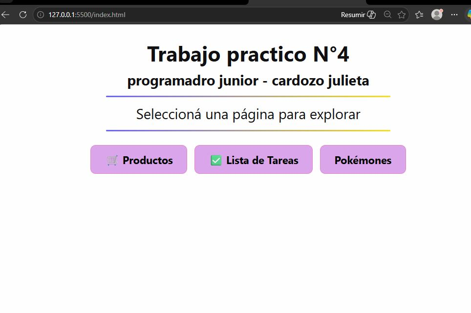
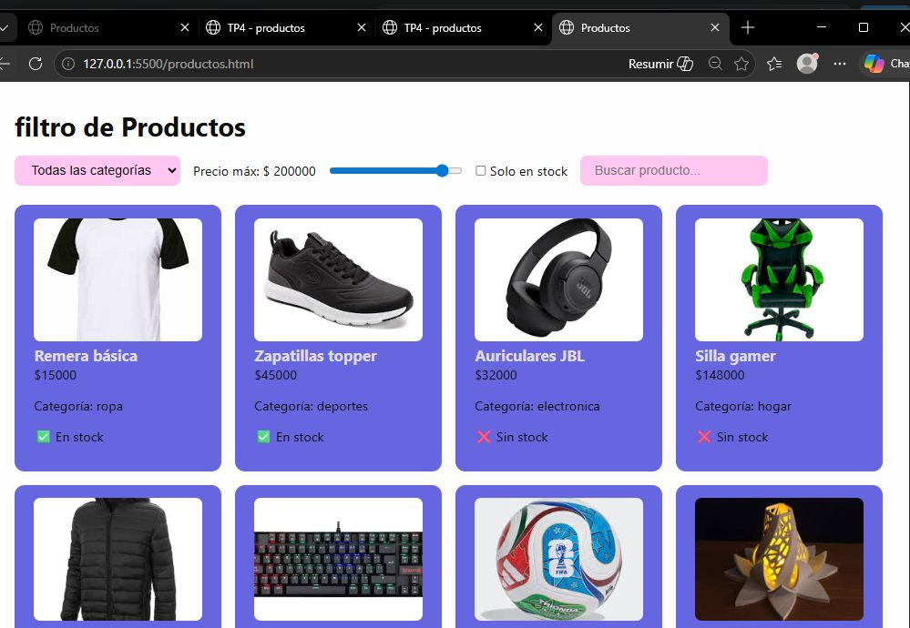
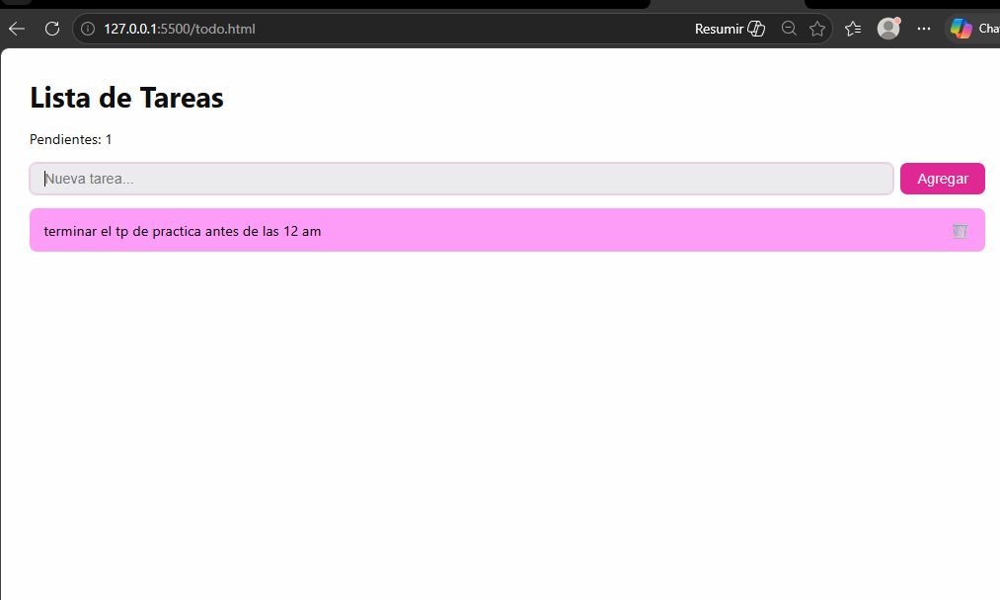
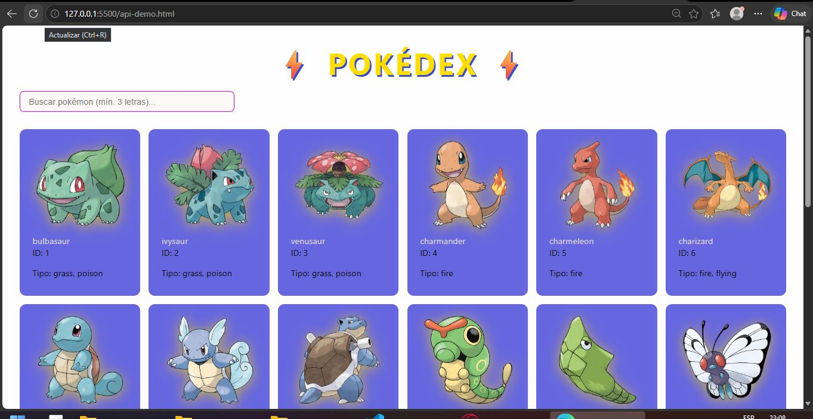

## TRABAJO PRACTICO N4
# ALUMNO: CARDOZO JULIETA ANDREA
# DNI :44696414

## Descripción
Mini-aplicación web interactiva desarrollada como trabajo práctico integrador de JavaScript moderno ES6+.

## Páginas
- **productos.html** — Sistema de filtrado de productos con 4 filtros combinados en tiempo real (categoría, precio, stock y búsqueda)
- **todo.html** — Lista de tareas: agregar, completar y eliminar tareas con contador dinámico
- **api-demo.html** — Pokédex que consume la PokéAPI con búsqueda dinámica, imágenes, tipos y manejo de errores

## Tecnologías usadas
- HTML5
- CSS3 (variables CSS, Flexbox, Grid)
- JavaScript ES6+ (arrow functions, map, filter, reduce, find, destructuring)
- Fetch API
- async/await
- PokéAPI 

## PAGINA DEL PROYECTO
PRODUCTO HTML -SISTEMA DE FILTRADO
Sistema de filtrado con un array de 8 productos ,permite filtrar productos por categoria ,precimaximo
disponibilidad y busqueda por nombre
### 2. `todo.html` — Lista de tareas interactiva
Aplicación de To-Do list funcional con estilos profesionales y transiciones CSS.
### 3. `api-demo.html` — Pokédex con PokéAPI
Consume la [PokéAPI](https://pokeapi.co/) para mostrar pokémon como tarjetas con imagen ,nombre y enumerados con un id

## Estilos — `css/app.css`

Archivo CSS compartido para todas las páginas con:
- Variables CSS (`:root`) con paleta de colores coherente
- Layout responsive con Grid y Flexbox
- Tarjetas con sombras, border-radius y hover effect
- Estados visuales: loading, error, vacío
- Input de búsqueda estilizado con `:focus` visible
- Navegación con `<nav>` presente en todas las páginas
## Cómo usar
1. Clonar el repositorio: `git clone https://github.com/Julieta-Andrea-Cardozo/trabajo-practico-N4.git`
2. Abrir la carpeta en VS Code
3. Clic derecho en `index.html` → Open with Live Server
O accedé directamente al :https://julieta-andrea-cardozo.github.io/trabajo-practico-N4 
## Estructura del proyecto

```
tp2_java/
├── index.html
├── productos.html
├── todo.html
├── api-demo.html
├── README.md
├── css/
│   ├── style.css
│   └── app.css
├── imagenes/
│   ├── remera.png
│   ├── topper.png
│   ├── auri.png
│   ├── silla.png
│   ├── campera.png
│   ├── teclado.png
│   ├── pelota.png
│   └── 3d.png
└── js/
    ├── api.js
    ├── ejercicios.js
    ├── productos.js
    └── todo.js
```
## INICIO






